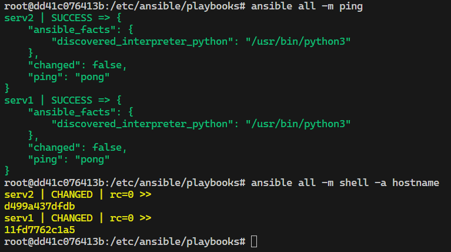
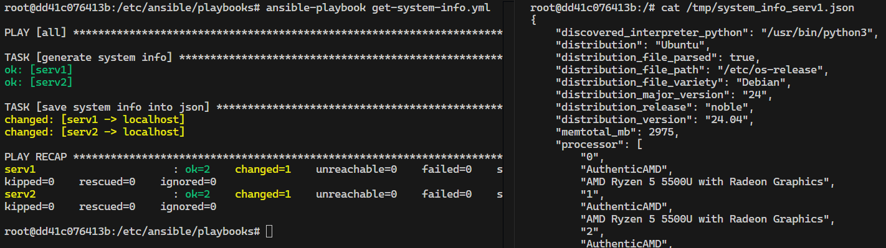
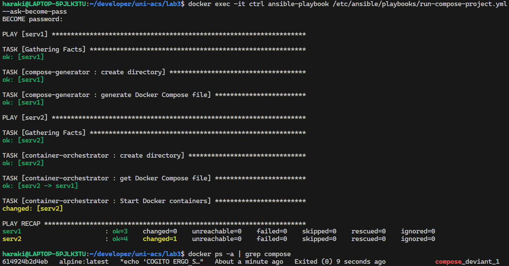

# Отчет по лабораторной работе 3

### Шипилов Дементий, ИП-215

## Ansible. Базовая часть

Для инициализации среды *Ansible* со структурой каталогов *{inventory, playbooks, roles}* необходимо в файле */etc/ansible/ansible.cfg* инициализировать параметры `roles_path` и `inventory` путями необходимых директории и файла.

Для настройки подключений к управляемым Ansible'ом серверам, необходимо создать ssh-ключ на управляющей машине (Ansible control node) и скопировать его на управляемые сервера, используя OpenSSH

``` shell
ssh-keygen -t ed25519
ssh-copy-id -i ~/.ssh/id_ed25519.pub ${dest-server}
```

## DoD на 3

Выполнение *ad-hoc* команд `ping` и `shell -a hostname`



## DoD на 4

Результат работы *playbook*'a по получению информации об управляемых серверах



## DoD на 5

> Для модуля *synchonize* (*rsync*) необходимо также попарно настроить беспарольное ssh-подключение между серверами

Результат работы роли по генерации файла *docker-compose.yml* и запуска на его основе контейнеров


